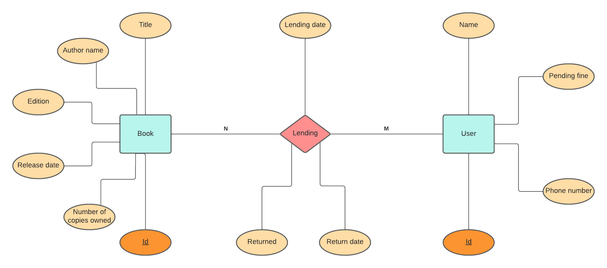
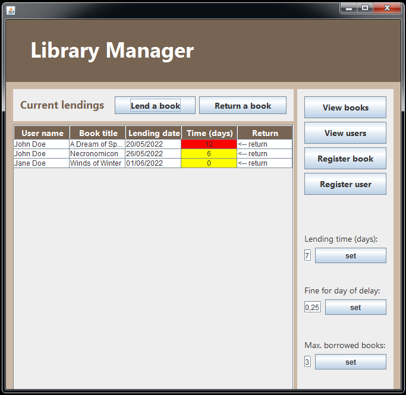
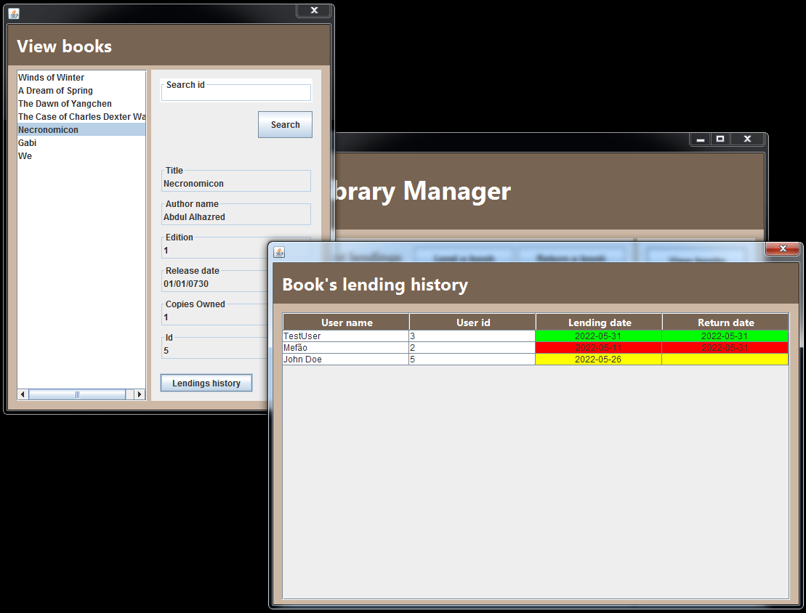

# Library Manager

A Java application to manage the lending of books.


## Registering

Books' and users' data can be stored and accessed. The lending and return of books can be registered, having its dates defined automatically by the application based on the computer's date.
Fines for delay are calculated and registered at the moment of the book's return. The payment of such fines can also be registered.

## Display

- Delayed lendings are displayed in a **red** background
- Not delayed and not yet returned lendings are displayed in a **yellow** background
- Lendings returned in the correct time are displayed in a **green** background

## Business rules

The application enforces basic rules for a library:
- An user can only have a single copy of a book borrowed at a time
- An user with pending fines can't borrow any more books
- An user with an unreturned delayed book can't borrow any more books
- An user can only have simultaneously borrowed books up to a limited amount
- The library can't lend more copies of a book than it have available

## Settings

Through the interface it can be set:
- The allowed duration of lendings
- The fine for each day of delay
- The maximum amount of books each user can have borrowed simultaneously

## Database

Data about books, users and lendings is persistently stored in a SQL database. During the development of this project, the database used was MariaDB 10.4.24.
To setup the tables needed, run the following SQL queries:
```
CREATE TABLE `librarymanager`.`books` (`title` VARCHAR(255) NOT NULL , `authorName` VARCHAR(255) NOT NULL , `edition` INT NOT NULL , `releaseDate` DATE NOT NULL , `copiesOwned` INT NOT NULL , `id` INT NOT NULL AUTO_INCREMENT , PRIMARY KEY (`id`)) ENGINE = InnoDB;

CREATE TABLE `librarymanager`.`users` (`name` VARCHAR(255) NOT NULL , `phoneNumber` VARCHAR(20) NOT NULL , `fine` float NOT NULL , `id` INT NOT NULL AUTO_INCREMENT , PRIMARY KEY (`id`)) ENGINE = InnoDB;

CREATE TABLE `librarymanager`.`lendings` (`lendingDate` DATE NOT NULL , `returned` BOOLEAN NOT NULL , `returnDate` DATE NULL , `bookId` INT NOT NULL , `userId` INT NOT NULL , `id` INT NOT NULL AUTO_INCREMENT , PRIMARY KEY (`id`)) ENGINE = InnoDB;

ALTER TABLE `lendings` ADD CONSTRAINT `fk_books` FOREIGN KEY (`bookId`) REFERENCES `books`(`id`) ON DELETE RESTRICT ON UPDATE RESTRICT; ALTER TABLE `lendings` ADD CONSTRAINT `fk_users` FOREIGN KEY (`userId`) REFERENCES `users`(`id`) ON DELETE RESTRICT ON UPDATE RESTRICT;
```

Connections are made to localhost:3306 at the database "librarymanager", user = "root" and password = "".

## Entities



### Book
- Title
- Author name
- Edition
- Release date
- Number of copies owned
- Id

### User
- Name
- Pending fine
- Phone number
- Id

### Lending
- Book
- User
- Lending date
- Returned
- Return date

## Screenshots


